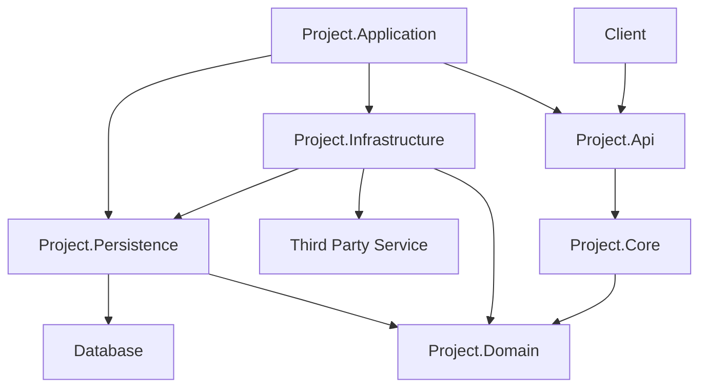

# Ozone Architecture Overview

The projects that currently make up Ozone use the same architecture, using the best parts of DDD, CQRS and various Clean Architecture patterns.

## Project Architecture

Module currently consist of the following projects:

<table>
  <tr>
    <th>Project</th>
    <th>Description</th>
    <th>Examples</th>
  </tr>
  <tr>
    <td>Ozone.Project.Application</td>
    <td>The Application project is the main entry point or the application that is being run as an executable. It takes care of setting up all other modules and linking up interfaces to their implementation.</td>
    <td>
      <li>The application main method</li>
      <li>Setup of Dependency Injection</li>
      <li>Linking up all other modules that are part of this application</li>
    </td>
  </tr>
  <tr>
    <td>Ozone.Project.Api</td>
    <td>The Api project is the entrypoint for third party users of the application. This usually contains the API controllers that can handle interact with the outside world.</td>
    <td>
      <li>API Controllers</li>
      <li>DTO definitions</li>
    </td>
  </tr>
  <tr>
    <td>Ozone.Project.Core</td>
    <td>When implementing CQRS, this is the project that contains all the logic for creating and handling commands and queries.</td>
    <td>
      <li>Command, Query and event handlers</li>
      <li>Application logic that is used by the "Api" project to create, update or interact in any way with other projects.</li>
    </td>
    </tr>
  <tr>
    <td>Ozone.Project.Infrastructure</td>
    <td>In the Infrastructure project, we can find the implementation of the interfaces defined in the Core and Domain project. The Infrastructure project is the only project that references external concerns and contains an implementation for their abstraction that is used throughout the application.</td>
    <td>
      <li>Implementation for external services like an email provider</li>
      <li>Implementation of third party libraries that are used in the application</li>
    </td>
  </tr>
  <tr>
    <td>Ozone.Project.Persistence</td>
    <td>Similar to the Infrastructure project, but contains the implementation for the persistence layer. Here the database access and other persistence related logic is implemented.</td>
    <td>
      <li>Database Connection</li>
      <li>Domain Repositories</li>
      <li>Domain Object => Database Object mapping</li>
    </td>
  </tr>
  <tr>
    <td>Ozone.Project.Domain</td>
    <td>The Domain project contains the domain model and the business logic of the application.</td>
    <td>
      <li>Entities that exist in the business logic</li>
      <li>Validation for entity objects</li>
      <li>Business logic</li>
    </td>
  </tr>
</table>

### Module Dependency Graph

## Base projects

Additionally, there are some base projects that contain common functionality that can be used by all projects of their respective kind. The projects can be identified by the `Ozone.Common` namespace e.g. `Ozone.Common.Domain`. Every project of a specific type should import the corresponding base project. Moreover, the "Ozone.Common" module provides abstractions that can be used by all other modules and is by default included by all project base modules.
