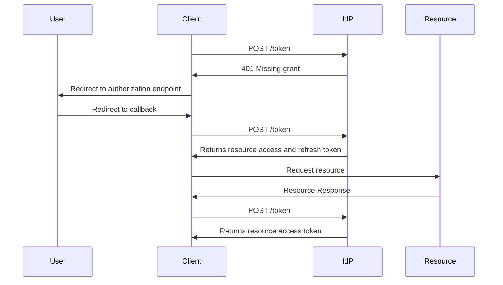
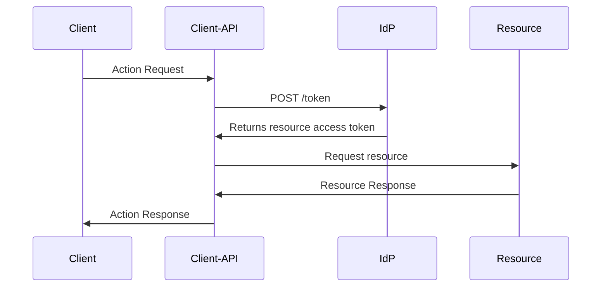

# Authorization Model

## Services

Services define a resource and all actions that can be performed with that resource. Trough the service, admins can register both [roles](#roles) and [service actions](#service-actions) for the resource that can be used for authorization in the resource. The idp will issue security tokens for the service that contain the service actions that the principal has access to.

## Roles

Roles define a set of [Service Actions](#service-actions) that can be performed by a principal. Principals with a certain role will be granted all service actions associated with that role. For every role, the idp provides a `<service-descriptor>/<role-name>` service action which can be used:

- By the client as a scope to grant access to all service actions associated with that role to a third party service
- By the service to check, whether the principal is a member of a certain role, rather than requiring a specific service action

## Service Actions

Service Actions define a specific action that can be performed on a resource. Service actions are scoped to a service and can be requested as a scope or keychain action in the security token. Service actions can be granted to principals through roles or can be directly assigned.

A Service Action might be `Dancing-Cats:Cats.GetCatById`, which would allow a principal to access the `https://dancing-cats.io/cat/<cat-id>` endpoint. You may or may not need to create such narrow service actions, but you can :).

## Key Chain

Security tokens contain a `keychain` claim which contains all the service actions that the user has access to.
The `keychain` will only contain the actions that the client has explicitly requested, either through `scopes`
or `keychain` fields in the authorization request (In case of service principals, it's defined in the application configuration).

A security token will only include granted service actions for the audience that it was issued for. Tokens including
`keychain` actions for third parties can be issued through:

- The OBO (On Behalf Of) flow in the case of services
- The Authorization Token Exchange flow in the case of clients

## Token Requests

When requesting a security token, clients will, by default, request a token for their service. If the client needs to request a token for a third party service, it can do so by specifying the target resource in the `resource` field of the authorization request. Alternatively, the client can request scopes or keychain actions for the target service, using it's FQN. If more than one service is specified trough either `resource` or `scope`, the authentication request will fail.

> Note: Global scopes such as `openid` or `offline_access` can be requested together with a resource or service scope.

The security token created by the idp will contain the target resource's client id in the `audience` claim.

When requesting a security token, the service scope can be omitted for both scopes and keychain actions. E.g.
`scope=Dancing-Cats:Cats.GetAll` can be simplified to `scope=Script.Cats.GetAll`.

### Same Resource Token Request

Authenticating the user

```http request
GET https://login.ozone.io/common/oauth2/v1.0/authorize?
client_id=c345f262-a752-463d-97ce-b8d55a1211bb
&redirect_uri=https://dancing-cats.io
&response_mode=query
&scope=openid offline_access Cats.GetAll
&state=12345
&code_challenge=<challenge-code>
&code_challenge_method=S256
```

Requesting an access token with the authorization code

```http request
POST https://identity.ozone.io/oauth2/v1.0/token HTTP/1.1
Content-Type: application/x-www-form-urlencoded

code=ASkdlaioixcjkyxjcwhqwndmawdqowlkdalsasdnycjxhASd
redirect_uri=https://dancing-cats.io
grant_type=authorization_code
code_verifier=<code-verifier>
client_secret="UrlEncodedClientSecret"
```

### Third Party Resource Token Request

Getting the user's consent for the third party resource

```http request
GET https://login.ozone.io/common/oauth2/v1.0/authorize?
client_id=c345f262-a752-463d-97ce-b8d55a1211bb
&redirect_uri=https://dancing-cats.io
&response_mode=discard // We're gonna use the token exchange flow
&scope=openid Dancing-Dogs:Default Dancing-Dogs:GetAll
&state=12345
&resource=https://dancing-cats.ozone.io // Not required when using a service scope
```

Exchanging the current token for a token with the third party resource

```http request
POST https://identity.ozone.io/oauth2/v1.0/token HTTP/1.1
Content-Type: application/x-www-form-urlencoded

grant_type=token-exchange
refresh_token=ASdiopaosidqwpdIDPOiPOadspPAisdopipaodp // dancing-cats.io token
client_id=c345f262-a752-463d-97ce-b8d55a1211bb
resource=https://dancing-dogs.ozone.io
```

### Token Exchange

Users with existing access tokens can exchange them for a new token with a different audience. The token exchange is done through the `token` endpoint and requires the `token-exchange` grant type. Any refresh token may be exchanged for a token for the same resource with different actions, or a different resource.

### Authorization Token Exchange

Clients may exchange an access token for a new token with different scopes or keychain actions. The token exchange is done through the `token` endpoint and requires the `authorization-token-exchange` grant type. Any refresh token may be exchanged for a token for the same resource with different actions, or a different resource, provided that the user has granted those actions to the client. If the client is requesting a token for a third party service, the user must have granted the client access to the actions on the third party resource in an authorization request.



### On Behalf Of

Services may need to call other APIs on behalf of the user. In those case, service resources can define third party resources, which can exchange a user's access token for a new token with different scopes or keychain actions defined for that service. The service's client secret is required to exchange the token. Clients may only use the token received from the token exchange for the third party and should never forward it anywhere else.


