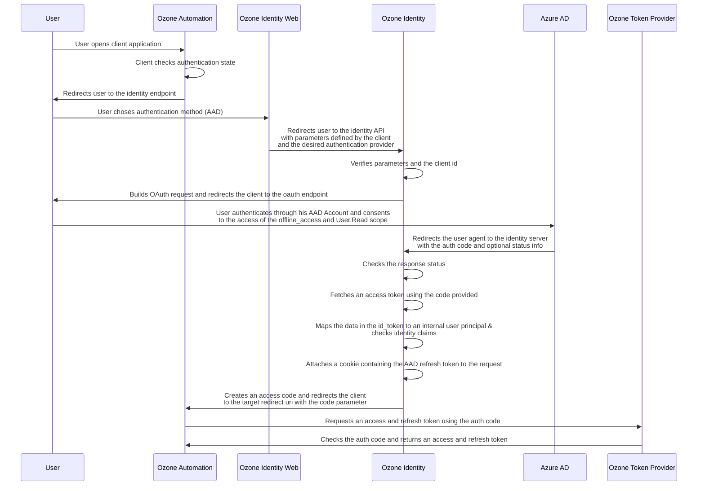
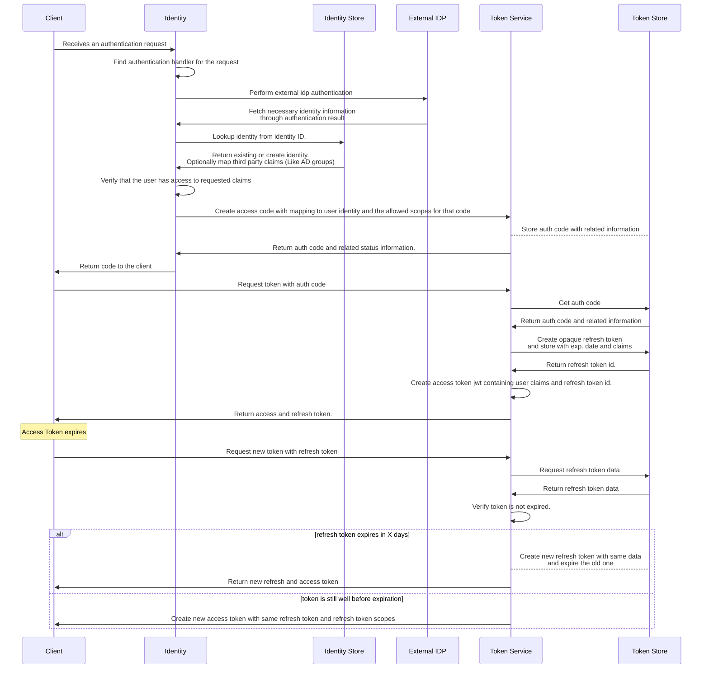

# Identity Federation Overview

Ozone allows users to sign in with a variety of identity providers, configured for the application. Clients can access basic user information from the identity provider trough the id token. Additionally, clients can request the user to grant access to the identity provider's resources, given they know which idp they're integrating with.

# Example Federation Flow using Microsoft Identity Platform AAD

[Microsoft Identity Platform](https://learn.microsoft.com/en-us/azure/active-directory/develop/v2-oauth2-auth-code-flow)

Users may want to log into an ozone application using their microsoft account. Given that the ozone instance is configured with an authentication provider for microsoft, the user can use their microsoft account to log into the application.

- **Login Provider** refers to the client facing identity provider `https://login.ozone.io`
- **Identity Provider** refers to the identity provider API `https://identity.ozone.io`

## Client Login

When signing in the user, the client redirects the user to the identity provider's login page. The client may specify the federated identity provider to use, by passing the `identity_provider` parameter on the request. If it is omitted, the user may be presented with a list of identity providers to choose from.

```http request
GET https://login.ozone.io/common/oauth2/v1.0/authorize?
  client_id=c345f262-a752-463d-97ce-b8d55a1211bb
  &redirect_uri=https://dancing-cats.io
  &response_mode=query
  &scope=openid offline_access Cats.GetAll
  &state=12345
  &code_challenge=<challenge-code>
  &code_challenge_method=S256
  &identity_provider=microsoft-aad
  &identity_provider_options={"prompt": "login"}
```

| Parameter                   | Description                                                                                                                                        |
| --------------------------- | -------------------------------------------------------------------------------------------------------------------------------------------------- |
| `client_id`                 | The client id of the ozone application / service                                                                                                   |
| `redirect_uri`              | The url to redirect the user to after the login flow is complete                                                                                   |
| `response_mode`             | The response mode to use. `query` is recommended for web applications. Options include: `query`, `fragment` or `form_post`                         |
| `scope`                     | The scopes to request from the ozone identity provider. `openid` is required for the id token. `offline_access` is required for the refresh token. |
| `state`                     | The state to pass to the identity provider. This is used to prevent CSRF attacks.                                                                  |
| `code_challenge`            | The code challenge to use for PKCE.                                                                                                                |
| `code_challenge_method`     | The code challenge method to use for PKCE.                                                                                                         |
| `identity_provider`         | The identity provider to use for the login flow.                                                                                                   |
| `identity_provider_options` | The options to pass to the identity provider.                                                                                                      |

<details>
  <summary><h2>Internal Implementation Details</h2></summary>

The login provider keeps track of all login requests of clients. It keeps an object in local storage that contains the client id as the key and the current date as the value. If the client id is not present in the object, it is added. If it is present, the value is updated to the current date. If the timespan between the current date and the value exceeds 5 minutes, the value is updated to the current date. If the timespan is less than 5 minutes, the request is denied and the user is redirected with an error code.

```
ACTIVE_AUTH_REQUESTS: { [client-id]: DateTime }
```

After the user has decided, which identity provider they want to use, the login page will redirect the user to the ozone identity provider authentication endpoint. This is done to capture the login state for the user, such that it can be retrieved after the external identity provider login has completed.

```http request
GET https://identity.ozone.io/common/oauth2/v1.0/authorize?
 client_id=c345f262-a752-463d-97ce-b8d55a1211bb
 &redirect_uri=https://dancing-cats.ozone.io
 &response_mode=query
 &scope=openid offline_access Cats.GetAll
 &state=12345
 &code_challenge=<challenge-code>
 &code_challenge_method=S256
 &identity_provider=microsoft-aad
 &identity_provider_options={"prompt": "login"}
```

The identity server will validate the incoming request and forward it to the appropriate authentication provider, Microsoft Azure Active Directory in this case. The provider will then verify, that all additional parameters for that identity provider are valid. The idp will then temporarily persist the request data:

```
{
  // c345f262-a752-463d-97ce-b8d55a1211bb:microsoft-aad:43b2c2cc-fce0-4cd6-9ab6-ebe98cc114f2
  Id: <client-id:idp:correlation-id>
  RedirectUri: https://dancing-cats.ozone.io
  ResponseMode: query
  Scope: openid offline_access Cats.GetAll
  State: 12345
  CodeChallenge: <challenge-code>
  CodeChallengeMode: S256
  IdentityProvider: microsoft-aad
  IdpCodeChallenge: <idp-challenge-code>
  IdpCodeChallengeMethod: S256
  Nonce: 14b708be-3555-409e-a01d-d9626bbdb153
  ExpiresAt: CurrentDate + 5min
}
```

After that, the user is redirected to the identity provider's login page:

```http request
GET https://login.microsoft.com/{tenantId}/oauth2/v2.0/authorize?
 client_id=<ozone-client-id>
 &response_mode=query
 &redirect_uri=https://identity.ozone.io/oauth2/v1.0/authorize/callback/microsoft-aad
 &scope=openid offline_access offline_access User.Read
 &code_challenge=<idp-code-challenge>
 &code_challenge_method=S256
 &state=c345f262-a752-463d-97ce-b8d55a1211bb:microsoft-aad:43b2c2cc-fce0-4cd6-9ab6-ebe98cc114f2
 &response_type=code id_token
 &nonce=14b708be-3555-409e-a01d-d9626bbdb153
```

</details>

## Microsoft Authentication

The user is redirected to the microsoft's login page. If the user is not already logged in, they will be prompted to log in. After they are already logged in, they will be prompted to grant the ozone application access to their microsoft account. (This only happens the first time, the user logs in using Microsoft, because all ozone applications use the same Azure Application) This will only include the default scopes requested by ozone, which are `User.Read`, `openid` and `offline_access`.

```http request
GET https://login.microsoft.com/{tenantId}/oauth2/v2.0/authorize?
client_id=<ozone-azure-application-client-id>
&response_mode=query
&redirect_uri=https://identity.ozone.io/oauth2/v1.0/authorize/callback/microsoft
&scope=openid offline_access offline_access User.Read
&code_challenge=<idp-code-challenge>
&code_challenge_method=S256
&state=c345f262-a752-463d-97ce-b8d55a1211bb:microsoft-aad:43b2c2cc-fce0-4cd6-9ab6-ebe98cc114f2
&response_type=code id_token
&nonce=14b708be-3555-409e-a01d-d9626bbdb153
&prompt=login
```

After the user has logged in and granted access to the ozone application, they will be redirected to the login providers callback url with the access code or error.

<details>
  <summary><h2>Internal Implementation Details</h2></summary>
  
  The user is first redirected to the identity provider to restore the authentication state from temporary storage.

```http request
GET https://identity.ozone.io/oauth2/v1.0/authorize/callback/microsoft-aad?
 code=AwABAAAAvPM1KaPlrEqdFSBzjqfTGBCmLdgfSTLEMPGYuNHSUYBrq
 &id_token=eyj...
 &state=c345f262-a752-463d-97ce-b8d55a1211bb:AAD:43b2c2cc-fce0-4cd6-9ab6-ebe98cc114f2
```

The identity provider will then verify, that the state is valid and can be restored to an authentication state, that has not expired yet. The state will then be deleted from temporary storage.

The idp will verify the `nonce` in the id token provided by the external idp.

If the external authentication was successful, the idp will try to request an access token from the external idp using the code it has just received. The idp will then cross check the `sub` claim in the id token with the `sub` claim in the access token. If they match, we can safely assume, that the user has successfully authenticated against the idp and that the response has not been tampered with.

```http request
POST https://login.microsoftonline.com/{tenant}/oauth2/v2.0/token?
 client_id=<ozone-client-id>
 &client_secret=<ozone-client-secret>
 &code=AwABAAAAvPM1KaPlrEqdFSBzjqfTGBCmLdgfSTLEMPGYuNHSUYBrq
 &redirect_uri=https://identity.ozone.io/oauth2/v1.0/authorize/callback/microsoft-aad
 &grant_type=authorization_code
 &code_verifier=<idp-code-challenge-verifier>
```

The user is then mapped to an internal identity principal trough a identifier generated using the following scheme:

`IdpId:IdpIdentityId - microsoft-aad:36a754c0-43c1-44b5-973f-2764e85a49e2`

> If the user has registered multiple identity providers, he might have multiple external identifiers

The idp will verify, that the user exists (if not, it will be created) and that the user has the required permissions for the scopes requested by the client.

After that, the idp will generate an opaque authorization code, which will be persisted with the remaining authentication state in temporary storage.

```object
{
  Code: ASkdlaioixcjkyxjcwhqwndmawdqowlkdalsasdnycjxhASd
  RedirectUri: https://dancing-cats.ozone.io
  Scopes: openid offline_access Cats.GetAll
  Identity: microsoft-aad:36a754c0-43c1-44b5-973f-2764e85a49e2
  CodeChallenge: <challenge-code>
  CodeChallengeMode: S256
  CorrelationId: 43b2c2cc-fce0-4cd6-9ab6-ebe98cc114f2
  ExpiresIn: CurrentDate + 2m
  Idp: microsoft-aad
  IdpRefreshToken: eyi.xxx
}
```

The idp then checks, wether the user has already granted the client access to the requested scopes. If not, the user will be redirected to the consent page.

```http request
GET https://login.ozone.io/common/oauth2/v1.0/authorize?
 client_name=Dancing Cats 🐈
 &code=ASkdlaioixcjkyxjcwhqwndmawdqowlkdalsasdnycjxhASd
 &scopes=[{"name": "Dancing-Cats:Cats.GetAll", "description": "Get all the cats (Meow! :3)"}, {"name": "openid", "description": "Access to your user profile"}, {"name": "offline_access", "description": "Maintain granted access to resources"}]
 &redirect_uri=https://dancing-cats.io
 &response_mode=query
 &state=12345
```

Otherwise, the user will be redirected to the client with the authorization code.

```http request
GET https://dancing-cats.io?
 client_name=Ozone Automation
 &code=ASkdlaioixcjkyxjcwhqwndmawdqowlkdalsasdnycjxhASd
 &state=12345
```

</details>

## User Consent

After authenticating with the external identity provider, the user will be redirected to the ozone consent page, if the user has not already granted the client access to the requested scopes.

```http request
GET https://login.ozone.io/common/oauth2/v1.0/authorize?
 client_name=Dancing Cats 🐈
 &code=ASkdlaioixcjkyxjcwhqwndmawdqowlkdalsasdnycjxhASd // opaque authorization code
 &scopes=[{"name": "Dancing-Cats:Cats.GetAll", "description": "Get all the cats (Meow! :3)"}, {"name": "openid", "description": "Access to your user profile"}, {"name": "offline_access", "description": "Maintain granted access to resources"}]
 &redirect_uri=https://dancing-cats.io
 &response_mode=query
 &state=12345
```

Here, he'll be able to review the requested permissions and grant or deny access to the client.

```
Permission requested for
<image> Dancing Cats 🐈
This app would like to:
{Get All Cats}
- Get all the cats (Meow! :3)
{Profile Information}
- Access to your user profile
{Offline Access}
- Maintain granted access to resources
[Cancel] [Accept]
```

### User Acceptance

If the user allows the grant, the user agent is redirected to the client:

```http request
GET https://dancing-cats.io?
 &code=ASkdlaioixcjkyxjcwhqwndmawdqowlkdalsasdnycjxhASd
 &state=12345
```

> We intentionally don't store the authentication state on the client such that, if the user needs to sign in with a
> different user account, he can do that after signing out of the client application. Otherwise the login endpoint would
> automatically re-authenticate the user, not giving him a chance to change the login information. The user's authentication state is in sync with the external identity provider's. Of curse, the user can still sign out of the ozone application, which will invalidate any access tokens and refresh tokens on ozone's side.

### User Denial

If the user does not accept, the code is discarded and will expire 2 minutes after it was generated. The user agent is then redirected to the redirect uri with an error code.

```http request
GET https://dancing-cats.io?
 &error=access_denied
 &error_description=The+user+denied+access+to+the+requested+scopes
 &state=12345
```

## Requesting an Access Token

The client can now request an access token using the authorization code:

```http request
POST https://identity.ozone.io/oauth2/v1.0/token HTTP/1.1
Content-Type: application/x-www-form-urlencoded

code=ASkdlaioixcjkyxjcwhqwndmawdqowlkdalsasdnycjxhASd
redirect_uri=https://automation.ozone.io
grant_type=authorization_code+idp_token+id_token
code_verifier=<code-verifier>
client_secret="UrlEncodedClientSecret"
refresh_token_response_mode=cookie
```

### Table of Parameters

| Parameter                     | Required / Optional        | Description                                                                                                                                                                               |
| ----------------------------- | -------------------------- | ----------------------------------------------------------------------------------------------------------------------------------------------------------------------------------------- |
| `code`                        | `required`                 | The authorization code received from the authorization endpoint                                                                                                                           |
| `redirect_uri`                | `required`                 | The redirect uri used in the authorization request                                                                                                                                        |
| `grant_type`                  | `required`                 | The grant type. Must be `authorization_code`. Additionally, the client may specify `idp_token` and `id_token` to receive the respective tokens in the token response.                     |
| `code_verifier`               | `required`                 | The code verifier used in the authorization request                                                                                                                                       |
| `client_secret`               | `optional` for public apps | The client secret. Only required for non spa apps                                                                                                                                         |
| `refresh_token_response_mode` | `optional`                 | The response mode for the refresh token. Can be `cookie` or `body`. Defaults to `cookie`. The refresh token for the idp will always be sent as a cookie, if it's requested by the client. |

### Http Response

```http request
HTTP/1.1 200 OK
Set-Cookie: X-OZONE-REFRESH-TOKEN=yxcopuipoWOPQIDmasdahjLWJLQJldasdyxdsassd Secure; HttpOnly; SameSite=Strict;
Set-Cookie: X-MICROSOFT-AAD-REFRESH-TOKEN=XYopcialsdkwjqlkdjasjldyxuciuasd Secure; HttpOnly; SameSite=Strict;
Content-Type: application/json

{
  "access_token": "eyJciIsIng1dCI6Ik5HVEZ2ZEstZnl0aEV1Q..."
  "token_type": "Bearer",
  "scope": "offline_access openid Dancing-Cats:Cats.GetAll",
  "expires_in": 3599,
  "microsoft-aad_token": "eyJ0eXAiOiJKV1QiLCJhbG...",
  "microsoft-aad_token_type": "Bearer",
  "microsoft-aad_expires_in": 3599,
  "idp_id": "microsoft-aad",
  "id_token": "eyJ0eXAiOiJKV1QiLCJhbGciOiJub25lIn0...",
}
```

<details>
  <summary><h2>Internal Implementation Details</h2></summary>

The idp will determine the token grant handler based on the grant type. The grant handler will then verify, that all required parameters are set and valid.

The idp will then verify, that the authorization code is valid and has not expired. The code verifier is then verified against the code challenge. The redirect uri is verified against the one used in the authorization request. If a client secret is required, it is hashed and compared against the one stored in the persistence layer.

If all verifications are successful, the idp will invalidate the authorization code and create a new `Authorization Grant` for the client. The grant contains the service actions that the client is allowed to request on behalf of the user. The grant is then stored in the persistence layer.

If the client requests the idp token, the server will attach the idp refresh token in the desired format

If the client requests the id token, the server will generate a new id token for the user identity and attach it to the response body.

The idp will then create an opaque refresh token and store it in the persistence layer along with the service actions that it can be used for and its expiration date (2 weeks). The refresh token is then also attached as a cookie in the response.

The idp creates an access security token containing the service actions that the client has requested. The token is then signed and attached to the response body.

The idp then sends that response back to the client.

</details>

## Requesting an External Identity Provider Token

If the client has requested the idp token, it can then request an access token for the external identity provider using the refresh token that was attached to the response in a cookie:

```http request
POST https://identity.ozone.io/oauth2/v1.0/token HTTP/1.1
Content-Type: application/x-www-form-urlencoded

grant_type=idp_refresh_token
```

### Table of Parameters

| Parameter    | Required / Optional | Description                                  |
| ------------ | ------------------- | -------------------------------------------- |
| `grant_type` | `required`          | The grant type. Must be `idp_refresh_token`. |

### Http Response

```http request
HTTP/1.1 200 OK
Content-Type: application/json

{
  "access_token": "eyJcialskdlAPSDAdajwajlkOOasda..."
  "token_type": "Bearer",
  "scope": "offline_access openid User.Read",
  "expires_in": 3599,
  "idp_id": "microsoft-aad",
  "id_token": "eyJASdkljASDoaLknmZXcpopoIPQW...",
}
```

Additionally, the client may request additional scopes for the external identity provider:

```http request
POST https://identity.ozone.io/oauth2/v1.0/token HTTP/1.1
Content-Type: application/x-www-form-urlencoded
Cookie: X-MICROSOFT-AAD-REFRESH-TOKEN=XYopcialsdkwjqlkdjasjldyxuciuasd

grant_type=idp_refresh_token
&identity_provider=microsoft-aad
&redirect_uri=https://dancing-cats.io
&scope=https://graph.microsoft.com/User.ReadWrite
```

### Table of Parameters

| Parameter    | Required / Optional | Description                                             |
| ------------ | ------------------- | ------------------------------------------------------- |
| `grant_type` | `required`          | The grant type. Must be `idp_refresh_token`.            |
| `scope`      | `optional`          | The additional scopes to request from the external idp. |

### Http Response

```http request
HTTP/1.1 200 OK
Content-Type: application/json
Set-Cookie: X-MICROSOFT-AAD-REFRESH-TOKEN=ASdOIpoidajslkASid...; HttpOnly; Secure; SameSite=Strict

{
  "access_token": "eyJ0eXAiOiJKV1QiLCJhbGciOiJSUzI1NiIsIng1dCI6Ik5HVEZ2ZEstZnl0aEV1Q..."
  "token_type": "Bearer",
  "scope": "offline_access openid https://graph.microsoft.com/User.ReadWrite",
  "expires_in": 3599,
  "idp_id": "microsoft-aad",
  "id_token": "eyJASdkljASDoaLknmZXcpopoIPQW...",
}
```

<details>
  <summary><h2>Internal Implementation Details</h2></summary>

The idp will retrieve the refresh token from the cookie that correlates with the identity provider requested by the client and verify that it is set and valid. The idp will then retrieve the `Authorization Grant` from the persistence layer and verify that it is valid and has not expired. The idp will then verify that the client is allowed to request the requested scopes from the external identity provider and that the idp refresh token was generated for the redirect uri.

When all verifications are successful, the the idp will send a token grant request to the external identity provider.

```http request
POST https://login.microsoftonline.com/{tenantId}/oauth2/v2.0/token HTTP/1.1
Content-Type: application/x-www-form-urlencoded

client_id=<ozone-client-id>
&scope=offline_access openid https://graph.microsoft.com/User.ReadWrite
&refresh_token=XYopcialsdkwjqlkdjasjldyxuciuasd...
&grant_type=refresh_token
&client_secret=<ozone-client-secret>
```

The idp will then verify that the response is valid and contains the requested scopes.

If the request was successful, the idp will replace the idp refresh token (if provided) to the response in a cookie and attach the new access token to the response body.

```http request
HTTP/1.1 200 OK
Content-Type: application/json
Set-Cookie: X-MICROSOFT-AAD-REFRESH-TOKEN=ASdOIpoidajslkASid...; HttpOnly; Secure; SameSite=Strict

{
  "access_token": "eyJ0eXAiOiJKV1QiLCJhbGciOiJSUzI1NiIsIng1dCI6Ik5HVEZ2ZEstZnl0aEV1Q..."
  "token_type": "Bearer",
  "scope": "offline_access openid https://graph.microsoft.com/User.ReadWrite",
  "expires_in": 3599,
  "idp_id": "microsoft-aad",
  "id_token": "eyJASdkljASDoaLknmZXcpopoIPQW...",
}
```

</details>

### Unauthorized External Identity Provider Scopes

If the user has never granted the client access to the external identity provider, the client will receive an error response:

```http request
HTTP/1.1 401 Unauthorized
Content-Type: application/json

{
  "error": "invalid_grant",
  "error_description": "The user has not granted the client access to the external identity provider."
}
```

In which case the client should redirect the user to the authorization endpoint to request access to the external identity provider:

```http request
GET https://login.ozone.io/common/oauth2/v1.0/authorize?
client_id=c345f262-a752-463d-97ce-b8d55a1211bb
&redirect_uri=https://dancing-cats.io
&response_mode=discard
&scope=openid Dancing-Dogs:Default Dancing-Dogs:GetAll
&state=12345
```

### Table of Parameters

| Parameter       | Required / Optional | Description                                                                                                                                                                                                              |
| --------------- | ------------------- | ------------------------------------------------------------------------------------------------------------------------------------------------------------------------------------------------------------------------ |
| `client_id`     | `required`          | The client id.                                                                                                                                                                                                           |
| `redirect_uri`  | `required`          | The redirect uri.                                                                                                                                                                                                        |
| `response_mode` | `required`          | The response mode. If the client does not need an authorization code, `discard` can be used to have the idp not return anything to the client. This allows clients to omit things like client secrets and PKCE verifiers |
| `scope`         | `required`          | The additional scopes to request from the external identity providers.                                                                                                                                                   |
| `state`         | `required`          | The state.                                                                                                                                                                                                               |

The user will then have to grant the client access to the external identity provider. After the user has granted access, the idp will redirect the user to the redirect uri. If the client has requested the `discard` response mode, the idp will not return anything to the client. The client can then retry the request to the token endpoint in order to retrieve an access token with the required permissions.

> Note: The identity provider stores the additional idp scopes on the authorization grant for the client. If the client requests additional scopes that the user has already granted to a different client, the idp will redirect the user to the idp login provider, instead of the external idp, in order for the user to explicitly grant the client access to the additional scopes on the external idp.

## AAD External Authentication Flow



## Token generation process


